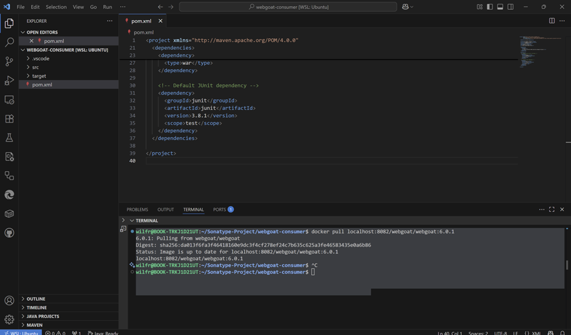

# WeGoat Project Process Completion

## Phase 1: Git Workflow and Repository Setup

### Objective  
The goal here was to set up a clean and auditable Git workflow — one that reflects how an enterprise team would collaborate on a secure Java application using Maven and Sonatype tooling. This setup forms the foundation for traceability, reproducibility, and a secure software supply chain going forward.

### Step-by-Step Execution  
1. **Cloned the Official Repository**  
   I started by cloning the official OWASP WebGoat legacy repository to my local environment. This gave me the complete project files to work with for my DevSecOps proof of concept.  

2. **Created a Working Branch**  
   Next, I created a new branch called `webgoat-devsecops-poc`. This is where I’ll do all my changes so that the original codebase stays untouched. This also helps keep my work isolated and trackable.  

3. **Added Upstream Remote (Optional but Good Practice)**  
   To stay in sync with the original project, I added the upstream remote. This way, I can pull updates from the main repo later if needed, without disrupting my local work. I fetched the latest changes and rebased my branch with the `develop` branch from upstream to make sure I'm working on the most recent version.  

4. **Cleaned Up the Workspace with `.gitignore`**  
   I updated the `.gitignore` file to exclude unnecessary files — things like compiled Java classes, logs, `.idea/` folders from IntelliJ, `.vscode/` settings, and OS junk like `.DS_Store`. This keeps the repo clean and avoids committing anything that doesn’t belong in version control.  
   After updating the `.gitignore`, I staged and committed the changes with a clear commit message to mark the cleanup.  

5. **Marked the Initial Commit and Tag**  
   To make things more traceable, I created an empty commit to mark the start of my DevSecOps work and tagged it as `phase-1-init`. This helps separate the clean setup phase from everything I’ll be adding later — useful for audits and version tracking.  

### Validation Checklist  
- Ran `git status` to confirm the workspace was clean.  
- `git log --oneline` showed the commits as expected.  
- The working branch is confirmed as `webgoat-devsecops-poc`.  

### DevSecOps Value of This Phase  
- **Traceability**: Everything from this point is properly version-controlled and can be audited later.  
- **Auditability**: I now have a clean, tagged baseline before applying any security enhancements.  
- **Security**: Cleaning up the workspace helps prevent leaking sensitive files or cluttering the repo with local development junk.  
- **Collaboration**: This kind of branching strategy makes it easy for other developers or teams to work with the project in a professional CI/CD pipeline.  

---

## Phase 2 – Maven Build and Local Execution  

### Objective  
The purpose of this phase was to build the WebGoat application locally using Apache Maven and Java 8. The aim was to ensure the project compiles successfully, generates deployable artefacts, and can run on localhost without any issues — all before moving on to containerisation and security evaluation.  

### Step-by-Step Execution  
1. **Updated the System Packages**  
   I started by refreshing the system's package repositories to make sure I had access to the latest available packages. During this update, a warning popped up related to an external Trivy repository. Since this was unrelated to the current task, I safely ignored it and continued.  

2. **Installed Java 8**  
   Next, I installed OpenJDK 8, which is required to compile and run the legacy Java codebase used in WebGoat. This version of Java aligns with the requirements of the older application.  

3. **Verified the Java Installation**  
   After the installation, I checked that Java 8 and its compiler were correctly installed and functioning. The version numbers matched what I expected, confirming the installation was successful.  

4. **Set Java 8 as the Default Runtime**  
   To avoid any version conflicts, I made sure that Java 8 was set as the default runtime environment on the system. I checked the Java alternatives and set the path to point specifically to the Java 8 installation. I also checked the environment variable `JAVA_HOME` and, since it wasn’t set, I added the correct path manually and updated the shell environment accordingly.  

5. **Installed Apache Maven**  
   With Java sorted, I moved on to installing Apache Maven — the build tool required for compiling the WebGoat project. After installation, I confirmed that Maven was accessible and reporting the correct version. This gave me confidence that the build environment was fully ready.  

6. **Built the WebGoat Project Using Maven**  
   From the root directory of the cloned WebGoat project, I ran a clean Maven build while skipping tests to speed up the process. Maven successfully cleaned the previous build output, downloaded the necessary dependencies, compiled the Java code, and packaged the application. Despite a few non-critical warnings about deprecated internal Java APIs and missing plugin versions, the build completed successfully.  

7. **Located the Build Artefacts**  
   After the build, I navigated to the `target/` directory and confirmed that two key artefacts were generated:  
   - A standard `.war` file  
   - A self-executing `.jar` file  
   These files are important for later deployment, particularly when moving to containerisation or publishing into secured environments.  

8. **Ran the Application Locally**  
   I launched the WebGoat application using the self-contained `.jar` file. The embedded Tomcat server started up without any fatal errors, and key logs confirmed that WebGoat had started successfully and was listening on port `8080`.  

9. **Tested the Application in the Browser**  
   To verify the runtime, I opened a web browser and navigated to `http://localhost:8080/WebGoat`. The login page loaded correctly. I tested the default login with the provided guest credentials, and was able to access the WebGoat interface with all the lessons available — confirming the application was fully functional in the local environment.  

### Outcome and Importance  
- The application built cleanly with Maven and ran without errors.  
- The generated artefacts are ready for use in upcoming containerisation and DevSecOps scanning phases.  
- This phase validated that the Java environment is correctly configured and the legacy WebGoat project is fully operational — providing a reliable starting point for secure build pipelines and vulnerability assessment.  


## Phase 3 – Secure Artifact Publishing and Containerised Deployment

### Objective  
The focus of this phase was to simulate a secure, enterprise-grade software delivery workflow. The main goals were:  
1. To generate a Software Bill of Materials (SBOM) for the WebGoat application using the CycloneDX Maven plugin.  
2. To package the compiled application into a Docker image.  
3. To run WebGoat as a containerised service locally to confirm it is deployment-ready.  
This phase is essential for aligning with modern DevSecOps practices — specifically in terms of software transparency, traceability, and secure packaging.  

### Step-by-Step Summary  

#### 1. SBOM Generation with CycloneDX  
- Integrated the **CycloneDX Maven plugin** into the project’s `pom.xml` under the plugin section. This allows the project to automatically generate SBOM files whenever the application is packaged.  
- Performed a Maven package build (skipping tests for speed). The build output included:  
  - Valid SBOM files in **XML** and **JSON** formats.  
  - Files generated in the `target/` directory, named using WebGoat’s versioning scheme.  
- **Purpose of SBOMs**:  
  Provides full visibility into third-party libraries/components used by the application — critical for:  
  - Vulnerability management  
  - Supply chain auditing  
  - Compliance with enterprise security policies.  


#### 2. Dockerised WebGoat Application  
Once the application had been compiled and its dependencies recorded via the SBOM, the next step was to containerise the application using Docker.  

- **Created a `Dockerfile`** with the following configuration:  
  - Base image: Lightweight **Java 8 runtime** (matching WebGoat's requirements).  
  - Defined a working directory inside the container.  
  - Copied the executable `.jar` file (generated by Maven) into the container.  
  - Exposed **port 8080** (used by WebGoat's embedded Tomcat server).  
  - Set the entry point to launch the application via Java runtime.  

- **Built the container image**:  
  - Applied a **version-specific tag** to track the WebGoat version.  
  - Verified successful creation by listing local Docker images (`docker images`), confirming:  
    - Expected tag and image size.  
    - Presence of the new WebGoat image in the list.  

- **Outcome**:  
  The image now represents a **portable, versioned, and self-contained** deployment artifact, ready for:  
  - Local validation  
  - Upload to a trusted container registry.  

#### 3. Local Runtime Validation  
To confirm the containerised application functioned correctly:  

1. **Launched the container**:  
   - Ran in detached mode (`-d` flag).  
   - Mapped container port 8080 → host port 8080 (`-p 8080:8080`).  

2. **Monitored logs**:  
   - Observed real-time logs (`docker logs -f <container_id>`) showing:  
     - Successful Tomcat initialization.  
     - Expected WebGoat startup sequence.  

3. **Tested in browser**:  
   - Accessed `http://localhost:8080/WebGoat`.  
   - Verified:  
     - Login page loaded.  
     - Default guest credentials worked.  
     - All lessons/functionality were accessible.  

- **Confirmation**:  
  The Docker image is **operational** and ready for:  
  - Vulnerability scanning  
  - Registry publishing  
  - Deployment in controlled environments.  


## Cleaning Up File Structure with .gitignore

### Context  
While preparing the WebGoat-Legacy project for containerisation and secure artifact publishing, I identified various files and directories that should not be version-controlled. These included:  
- Local development environment files  
- Build outputs and logs  
- IDE metadata  
- Temporary system files  
- Generated artefacts (e.g., SBOMs)  

These files are considered clutter from a version control perspective and can lead to:  
- Confusion and merge conflicts  
- Inconsistent environments across team members/machines  

### Step-by-Step Execution  

#### Step 1: Defined and Applied .gitignore Rules  
Created a `.gitignore` file at the project root with rules for:  
- **Build Artefacts**: `target/`, `*.class`, `*.jar`, `*.war`  
- **IDE Metadata**:  
  - IntelliJ: `.idea/`, `*.iml`  
  - Eclipse: `.settings/`, `.classpath`, `.project`  
  - VSCode: `.vscode/`  
- **Logs/Temporary Files**: `*.log`, `*.swp`, `*.bak`, `*.tmp`  
- **Conflict Markers**: `*.orig`, `*.rej`  
- **System Files**: `.DS_Store`, `Thumbs.db`  
- **Generated Files**: CycloneDX SBOM outputs  

#### Step 2: Removed Previously Tracked Ignored Files  
- Cleared already-tracked files from Git's index using:  
  ```bash
  git rm -r --cached .
  git add .


# Upload WebGoat to Nexus Repository (webgoat-releases)

## Objective  
The purpose of this phase was to automate the secure publishing of all essential components of the WebGoat application — including the WAR file, executable JAR, and CycloneDX SBOMs — into a private Nexus 3 repository. This provides a secure, traceable internal distribution channel that supports reproducibility, auditability, and supply chain visibility for future deployment and scanning.

## Repository Setup in Nexus OSS  
Using the Nexus Repository Manager UI, I created a new Maven hosted repository named `webgoat-releases`. This repository was configured as the target destination for all deployable artifacts produced by the WebGoat Maven build.  

To do this, I:  
1. Navigated to the "Repositories" section under the Nexus admin panel  
2. Selected "Create Repository"  
3. Chose the `maven2 (hosted)` option  
4. Named the repository `webgoat-releases`  
5. Left the default storage and blob store settings as-is  
6. Saved the configuration  

This repository is now fully accessible at `http://localhost:8081/repository/webgoat-releases/` and is ready to accept authenticated uploads via Maven.  

## Maven Project Configuration (pom.xml)  
Within the WebGoat project's `pom.xml` file, I added a `distributionManagement` block to instruct Maven where to deploy artifacts during the build process. The block defined the Nexus repository URL and gave it the ID `nexus`.  

```xml
<distributionManagement>
    <repository>
        <id>nexus</id>
        <url>http://localhost:8081/repository/webgoat-releases/</url>
    </repository>
</distributionManagement>


```markdown
# Phase 4: Maven Consumer Project – Artifact Retrieval from Nexus

## Objective  
The objective of this phase was to validate the successful retrieval of WebGoat artifacts deployed to Nexus during Phase 3 by simulating their consumption within a separate Maven-based project. This test confirms that internal development teams, build agents, or automated CI/CD pipelines can reuse versioned application components published to a secure internal repository. This is a critical capability in enterprise DevOps environments for supporting traceable, governed, and scalable software delivery practices.

## Step-by-Step Execution

### 1. Creation of a New Maven Consumer Project  
To ensure a clean and independent test environment:  
- Created standalone Maven project outside WebGoat-Legacy source tree  
- Scaffolded using `mvn archetype:generate`  
- Resulting structure:  
  - Basic Java application  
  - Independent `pom.xml`  
  - Separate source directories  

### 2. Configuration of pom.xml to Reference Nexus Repository  
```xml
<repositories>
    <repository>
        <id>nexus</id>
        <url>http://localhost:8081/repository/webgoat-releases/</url>
    </repository>
</repositories>

<dependencies>
    <dependency>
        <groupId>org.owasp.webgoat</groupId>
        <artifactId>WebGoat</artifactId>
        <version>6.0.1</version>
        <type>war</type>
    </dependency>
    <dependency>
        <groupId>junit</groupId>
        <artifactId>junit</artifactId>
        <version>4.13.2</version>
        <scope>test</scope>
    </dependency>
</dependencies>
```

### 3. Triggering a Fresh Dependency Resolution and Build  
```bash
mvn clean install -U
```
- Forces fresh download from Nexus  
- Recompiles from scratch  
- Validates dependency resolution  

### 4. Verification of Successful Artifact Retrieval  
- Build logs confirm successful WAR retrieval  
- All dependencies resolved  
- Local cache populated at `~/.m2/repository`  
- Unit tests executed successfully  

## Outcome  
Confirmed capabilities:  
- ✔ Controlled internal consumption of trusted artifacts  
- ✔ Reusability of versioned components  
- ✔ Transparent artifact origin tracking  

Enterprise impact:  
- Enables secure CI/CD pipelines  
- Supports governance requirements  
- Scales artifact sharing across teams  
```


```markdown
# Phase 5: Dockerisation and Image Publishing

## Objective  
The goal of this phase was to containerise the WebGoat application and securely publish it to an internally hosted Docker registry using Nexus Repository Manager. This ensures the application is packaged in a portable, reproducible, and version-controlled format that can be consumed by internal teams or automated pipelines as part of a secure software delivery lifecycle.

## Execution Summary

### 1. Dockerfile Creation  
Production-ready Dockerfile configuration:  
```dockerfile
FROM openjdk:8-jre-alpine
WORKDIR /app
COPY WebGoat-6.0.1-war-exec.jar .
EXPOSE 8080
CMD ["java", "-jar", "WebGoat-6.0.1-war-exec.jar"]
```

Key features:  
- Lightweight Java 8 Alpine base  
- Explicit port exposure (8080)  
- Single JAR execution  

### 2. Image Build  
```bash
docker build -t webgoat:6.0.1 .
```
Validation:  
- Confirmed container runtime stability  
- Verified Tomcat accessibility  

### 3. Nexus Docker Repository Setup  
Configured in Nexus UI:  
- Name: `docker-webgoat`  
- Type: Hosted Docker  
- Port: 8082  
- HTTP (local testing)  
- Authentication required  

### 4. Authentication Configuration  
```bash
docker login localhost:8082
```
Security steps:  
1. Enabled "Docker Bearer Token Realm"  
2. Used Nexus admin credentials  
3. Verified CLI connectivity  

### 5. Image Tagging and Push  
```bash
docker tag webgoat:6.0.1 localhost:8082/webgoat/webgoat:6.0.1
docker push localhost:8082/webgoat/webgoat:6.0.1
```
Push confirmation:  
- All layers uploaded  
- Manifest/digest recorded  

### 6. Verification  
Nexus UI checks:  
- Image visible at `/webgoat/webgoat:6.0.1`  
- Metadata intact  
- Accessible via pull  

## Outcome  
Achieved:  
- ✔ Production-grade containerisation  
- ✔ Versioned image in private registry  
- ✔ Secure authentication workflow  
- ✔ Ready for CI/CD consumption  

Enterprise benefits:  
- Full supply chain traceability  
- Controlled image distribution  
- Cloud-ready deployment  
```


```markdown
# Phase 5B: Docker Consumer Pull Validation

## Objective  
The goal of this validation step was to confirm that the Docker image of the WebGoat application, previously published to the internal Nexus Docker registry (docker-webgoat), can be successfully pulled and executed by downstream systems or team members. This simulates real-world consumption by developers, testers, or CI/CD agents, and ensures that the internal image repository is functioning correctly for secure software delivery.

## Execution Steps

### 1. Pulling the Image from Nexus  
```bash
docker pull localhost:8082/webgoat/webgoat:6.0.1
```

Verification:  
- Image digest matched published version  
- All layers successfully downloaded  
- Nexus access logs confirmed proper authentication  

### 2. Running the Pulled Image Locally  
```bash
docker run -d -p 8080:8080 localhost:8082/webgoat/webgoat:6.0.1
```

Validation checks:  
1. Container started without errors  
2. Accessed `http://localhost:8080/WebGoat`  
3. Confirmed:  
   - Login page rendered  
   - All lessons functional  
   - No runtime warnings  

## Outcome  
Validation confirmed:  
- ✔ Nexus registry properly serves container images  
- ✔ Version 6.0.1 maintains integrity when pulled  
- ✔ Image runs identically to local builds  

Enterprise readiness:  
- Supports developer workflows  
- Compatible with CI/CD pipelines  
- Enforces version control in deployments  
```



```markdown
# Phase 6: Nexus IQ Server Security Scan

## Objective  
To perform a complete security and license policy evaluation of WebGoat using Sonatype IQ Server, including:
- Scanning locally built `.war` artifact  
- Mapping to manually registered application ID  
- Resolving environment/CLI issues  
- Reviewing final security report  

## Execution Steps

### 1. Initial Setup and Java Compatibility  
**Issue**:  
```bash
UnsupportedClassVersionError: class file version 61.0 (requires Java 17)
```
**Solution**:  
```bash
# Install Java 17
sudo apt install openjdk-17-jdk

# Configure environment
export JAVA_HOME=/usr/lib/jvm/java-17-openjdk-amd64
export PATH=$JAVA_HOME/bin:$PATH

# Verification
java -version  # Should show Java 17
```

### 2. IQ Server Installation  
```bash
# Extract and launch with Java 17
tar -xzf nexus-iq-server-1.193.0-01-bundle.tar.gz
./nexus-iq-server-1.193.0-01/bin/nexus-iq-server start

# Access UI at:
http://localhost:8070
```
**Configuration**:  
- Uploaded license file  
- Created application:  
  - Name: `WebGoat`  
  - ID: `webgoat-app`  
  - Category: `Internal`  

### 3. CLI Tool Resolution  
**Workaround**:  
```bash
wget https://download.sonatype.com/clm/scanner/iq-cli-1.160.0-01.jar
mv iq-cli-1.160.0-01.jar iq-cli.jar
```

### 4. Building WebGoat Artifact  
```bash
mvn clean package -DskipTests
# Generated: target/WebGoat-6.0.1.war
```

### 5. Running Security Scan  
```bash
java -jar iq-cli.jar \
  -s http://localhost:8070 \
  -a admin:admin123 \
  -i webgoat-app \
  -t build \
  target/WebGoat-6.0.1.war
```

**Scan Results**:  
| Severity    | Violations | Components Affected |
|-------------|------------|---------------------|
| Critical    | 53         | 21                  |
| Severe      | 70         | 11                  |
| Moderate    | 8          | 2                   |

### 6. Report Analysis  
Key findings in IQ Server UI:  
- Component vulnerability breakdown  
- License compliance issues  
- Policy violation details  
- Risk threshold comparisons  

## Conclusion  
Successfully:  
✔ Resolved Java 17 compatibility  
✔ Established IQ Server instance  
✔ Acquired functional CLI scanner  
✔ Generated security report  

Next steps:  
- Document findings  
- Address critical vulnerabilities  
- Integrate into CI/CD pipeline  
```
