# WeGoat Project Process Completion

## Phase 1: Git Workflow and Repository Setup

### Objective  
The goal here was to set up a clean and auditable Git workflow — one that reflects how an enterprise team would collaborate on a secure Java application using Maven and Sonatype tooling. This setup forms the foundation for traceability, reproducibility, and a secure software supply chain going forward.

### Step-by-Step Execution  
1. **Cloned the Official Repository**  
   I started by cloning the official OWASP WebGoat legacy repository to my local environment. This gave me the complete project files to work with for my DevSecOps proof of concept.  

2. **Created a Working Branch**  
   Next, I created a new branch called `webgoat-devsecops-poc`. This is where I’ll do all my changes so that the original codebase stays untouched. This also helps keep my work isolated and trackable.  

3. **Added Upstream Remote (Optional but Good Practice)**  
   To stay in sync with the original project, I added the upstream remote. This way, I can pull updates from the main repo later if needed, without disrupting my local work. I fetched the latest changes and rebased my branch with the `develop` branch from upstream to make sure I'm working on the most recent version.  

4. **Cleaned Up the Workspace with `.gitignore`**  
   I updated the `.gitignore` file to exclude unnecessary files — things like compiled Java classes, logs, `.idea/` folders from IntelliJ, `.vscode/` settings, and OS junk like `.DS_Store`. This keeps the repo clean and avoids committing anything that doesn’t belong in version control.  
   After updating the `.gitignore`, I staged and committed the changes with a clear commit message to mark the cleanup.  

5. **Marked the Initial Commit and Tag**  
   To make things more traceable, I created an empty commit to mark the start of my DevSecOps work and tagged it as `phase-1-init`. This helps separate the clean setup phase from everything I’ll be adding later — useful for audits and version tracking.  

### Validation Checklist  
- Ran `git status` to confirm the workspace was clean.  
- `git log --oneline` showed the commits as expected.  
- The working branch is confirmed as `webgoat-devsecops-poc`.  

### DevSecOps Value of This Phase  
- **Traceability**: Everything from this point is properly version-controlled and can be audited later.  
- **Auditability**: I now have a clean, tagged baseline before applying any security enhancements.  
- **Security**: Cleaning up the workspace helps prevent leaking sensitive files or cluttering the repo with local development junk.  
- **Collaboration**: This kind of branching strategy makes it easy for other developers or teams to work with the project in a professional CI/CD pipeline.  

---

## Phase 2 – Maven Build and Local Execution  

### Objective  
The purpose of this phase was to build the WebGoat application locally using Apache Maven and Java 8. The aim was to ensure the project compiles successfully, generates deployable artefacts, and can run on localhost without any issues — all before moving on to containerisation and security evaluation.  

### Step-by-Step Execution  
1. **Updated the System Packages**  
   I started by refreshing the system's package repositories to make sure I had access to the latest available packages. During this update, a warning popped up related to an external Trivy repository. Since this was unrelated to the current task, I safely ignored it and continued.  

2. **Installed Java 8**  
   Next, I installed OpenJDK 8, which is required to compile and run the legacy Java codebase used in WebGoat. This version of Java aligns with the requirements of the older application.  

3. **Verified the Java Installation**  
   After the installation, I checked that Java 8 and its compiler were correctly installed and functioning. The version numbers matched what I expected, confirming the installation was successful.  

4. **Set Java 8 as the Default Runtime**  
   To avoid any version conflicts, I made sure that Java 8 was set as the default runtime environment on the system. I checked the Java alternatives and set the path to point specifically to the Java 8 installation. I also checked the environment variable `JAVA_HOME` and, since it wasn’t set, I added the correct path manually and updated the shell environment accordingly.  

5. **Installed Apache Maven**  
   With Java sorted, I moved on to installing Apache Maven — the build tool required for compiling the WebGoat project. After installation, I confirmed that Maven was accessible and reporting the correct version. This gave me confidence that the build environment was fully ready.  

6. **Built the WebGoat Project Using Maven**  
   From the root directory of the cloned WebGoat project, I ran a clean Maven build while skipping tests to speed up the process. Maven successfully cleaned the previous build output, downloaded the necessary dependencies, compiled the Java code, and packaged the application. Despite a few non-critical warnings about deprecated internal Java APIs and missing plugin versions, the build completed successfully.  

7. **Located the Build Artefacts**  
   After the build, I navigated to the `target/` directory and confirmed that two key artefacts were generated:  
   - A standard `.war` file  
   - A self-executing `.jar` file  
   These files are important for later deployment, particularly when moving to containerisation or publishing into secured environments.  

8. **Ran the Application Locally**  
   I launched the WebGoat application using the self-contained `.jar` file. The embedded Tomcat server started up without any fatal errors, and key logs confirmed that WebGoat had started successfully and was listening on port `8080`.  

9. **Tested the Application in the Browser**  
   To verify the runtime, I opened a web browser and navigated to `http://localhost:8080/WebGoat`. The login page loaded correctly. I tested the default login with the provided guest credentials, and was able to access the WebGoat interface with all the lessons available — confirming the application was fully functional in the local environment.  

### Outcome and Importance  
- The application built cleanly with Maven and ran without errors.  
- The generated artefacts are ready for use in upcoming containerisation and DevSecOps scanning phases.  
- This phase validated that the Java environment is correctly configured and the legacy WebGoat project is fully operational — providing a reliable starting point for secure build pipelines and vulnerability assessment.  

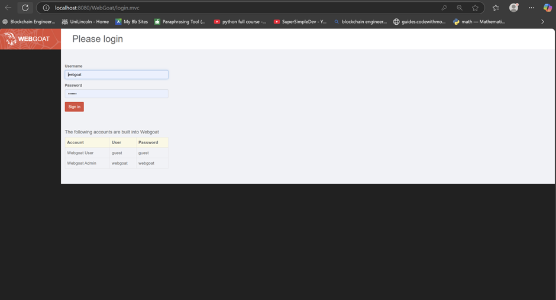

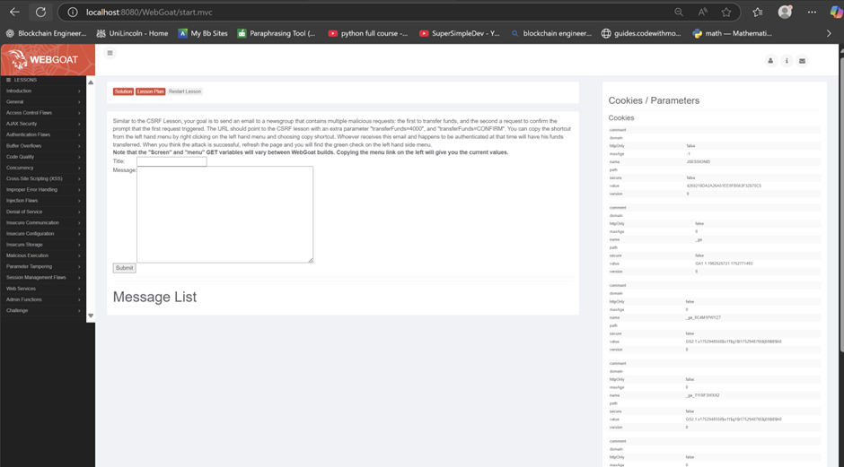

## Phase 3 – Secure Artifact Publishing and Containerised Deployment

### Objective  
The focus of this phase was to simulate a secure, enterprise-grade software delivery workflow. The main goals were:  
1. To generate a Software Bill of Materials (SBOM) for the WebGoat application using the CycloneDX Maven plugin.  
2. To package the compiled application into a Docker image.  
3. To run WebGoat as a containerised service locally to confirm it is deployment-ready.  
This phase is essential for aligning with modern DevSecOps practices — specifically in terms of software transparency, traceability, and secure packaging.  

### Step-by-Step Summary  

#### 1. SBOM Generation with CycloneDX  
- Integrated the **CycloneDX Maven plugin** into the project’s `pom.xml` under the plugin section. This allows the project to automatically generate SBOM files whenever the application is packaged.  
- Performed a Maven package build (skipping tests for speed). The build output included:  
  - Valid SBOM files in **XML** and **JSON** formats.  
  - Files generated in the `target/` directory, named using WebGoat’s versioning scheme.  
- **Purpose of SBOMs**:  
  Provides full visibility into third-party libraries/components used by the application — critical for:  
  - Vulnerability management  
  - Supply chain auditing  
  - Compliance with enterprise security policies.  


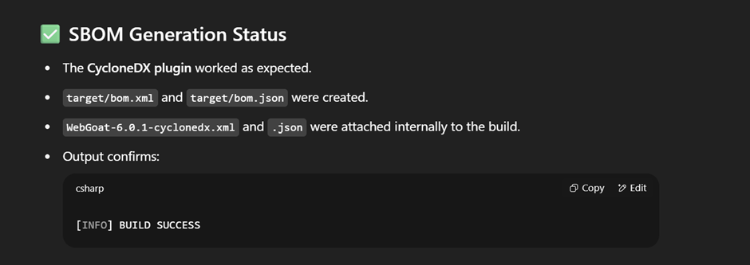

#### 2. Dockerised WebGoat Application  
Once the application had been compiled and its dependencies recorded via the SBOM, the next step was to containerise the application using Docker.  

- **Created a `Dockerfile`** with the following configuration:  
  - Base image: Lightweight **Java 8 runtime** (matching WebGoat's requirements).  
  - Defined a working directory inside the container.  
  - Copied the executable `.jar` file (generated by Maven) into the container.  
  - Exposed **port 8080** (used by WebGoat's embedded Tomcat server).  
  - Set the entry point to launch the application via Java runtime.  

- **Built the container image**:  
  - Applied a **version-specific tag** to track the WebGoat version.  
  - Verified successful creation by listing local Docker images (`docker images`), confirming:  
    - Expected tag and image size.  
    - Presence of the new WebGoat image in the list.  

- **Outcome**:  
  The image now represents a **portable, versioned, and self-contained** deployment artifact, ready for:  
  - Local validation  
  - Upload to a trusted container registry.  

#### 3. Local Runtime Validation  
To confirm the containerised application functioned correctly:  

1. **Launched the container**:  
   - Ran in detached mode (`-d` flag).  
   - Mapped container port 8080 → host port 8080 (`-p 8080:8080`).  

2. **Monitored logs**:  
   - Observed real-time logs (`docker logs -f <container_id>`) showing:  
     - Successful Tomcat initialization.  
     - Expected WebGoat startup sequence.  

3. **Tested in browser**:  
   - Accessed `http://localhost:8080/WebGoat`.  
   - Verified:  
     - Login page loaded.  
     - Default guest credentials worked.  
     - All lessons/functionality were accessible.  

- **Confirmation**:  
  The Docker image is **operational** and ready for:  
  - Vulnerability scanning  
  - Registry publishing  
  - Deployment in controlled environments.  


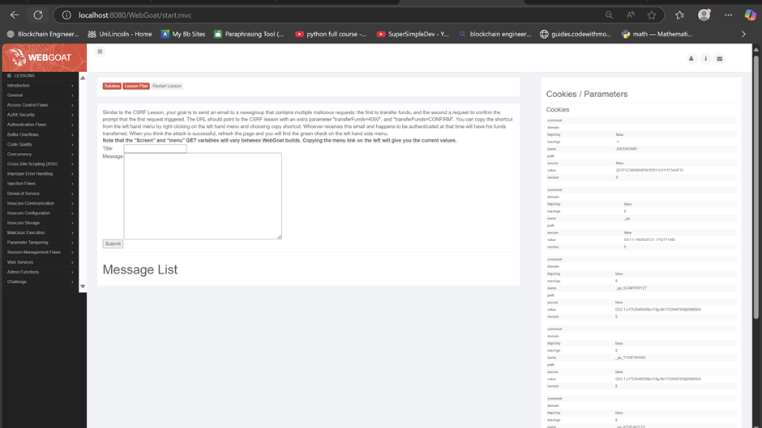

## Cleaning Up File Structure with .gitignore

### Context  
While preparing the WebGoat-Legacy project for containerisation and secure artifact publishing, I identified various files and directories that should not be version-controlled. These included:  
- Local development environment files  
- Build outputs and logs  
- IDE metadata  
- Temporary system files  
- Generated artefacts (e.g., SBOMs)  

These files are considered clutter from a version control perspective and can lead to:  
- Confusion and merge conflicts  
- Inconsistent environments across team members/machines  

### Step-by-Step Execution  

#### Step 1: Defined and Applied .gitignore Rules  
Created a `.gitignore` file at the project root with rules for:  
- **Build Artefacts**: `target/`, `*.class`, `*.jar`, `*.war`  
- **IDE Metadata**:  
  - IntelliJ: `.idea/`, `*.iml`  
  - Eclipse: `.settings/`, `.classpath`, `.project`  
  - VSCode: `.vscode/`  
- **Logs/Temporary Files**: `*.log`, `*.swp`, `*.bak`, `*.tmp`  
- **Conflict Markers**: `*.orig`, `*.rej`  
- **System Files**: `.DS_Store`, `Thumbs.db`  
- **Generated Files**: CycloneDX SBOM outputs  

#### Step 2: Removed Previously Tracked Ignored Files  
- Cleared already-tracked files from Git's index using:  
  ```bash
  git rm -r --cached .
  git add .

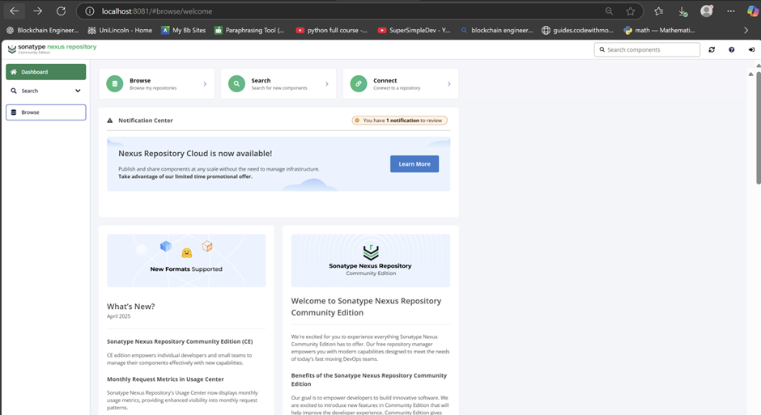

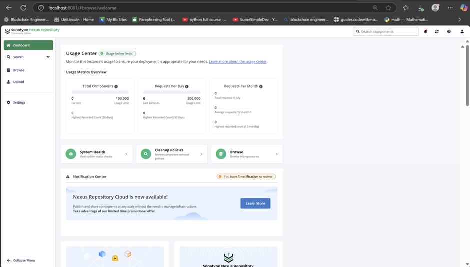

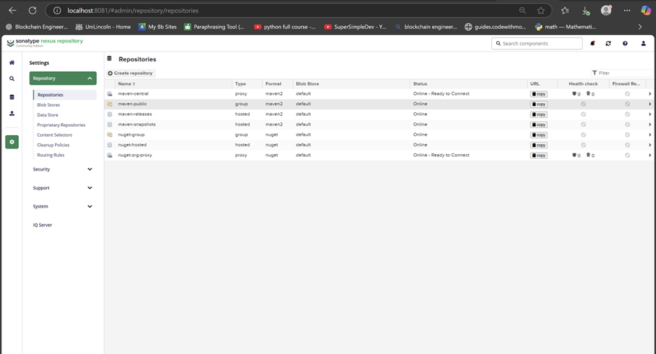

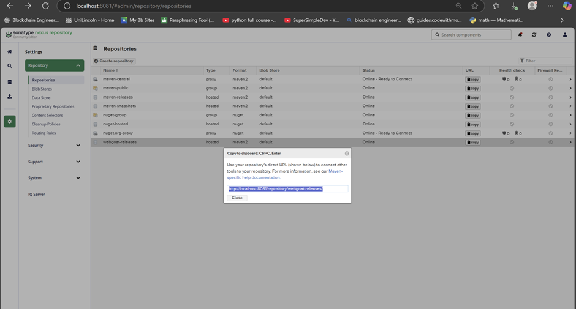

# Upload WebGoat to Nexus Repository (webgoat-releases)

## Objective  
The purpose of this phase was to automate the secure publishing of all essential components of the WebGoat application — including the WAR file, executable JAR, and CycloneDX SBOMs — into a private Nexus 3 repository. This provides a secure, traceable internal distribution channel that supports reproducibility, auditability, and supply chain visibility for future deployment and scanning.

## Repository Setup in Nexus OSS  
Using the Nexus Repository Manager UI, I created a new Maven hosted repository named `webgoat-releases`. This repository was configured as the target destination for all deployable artifacts produced by the WebGoat Maven build.  

To do this, I:  
1. Navigated to the "Repositories" section under the Nexus admin panel  
2. Selected "Create Repository"  
3. Chose the `maven2 (hosted)` option  
4. Named the repository `webgoat-releases`  
5. Left the default storage and blob store settings as-is  
6. Saved the configuration  

This repository is now fully accessible at `http://localhost:8081/repository/webgoat-releases/` and is ready to accept authenticated uploads via Maven.  

## Maven Project Configuration (pom.xml)  
Within the WebGoat project's `pom.xml` file, I added a `distributionManagement` block to instruct Maven where to deploy artifacts during the build process. The block defined the Nexus repository URL and gave it the ID `nexus`.  

```xml
<distributionManagement>
    <repository>
        <id>nexus</id>
        <url>http://localhost:8081/repository/webgoat-releases/</url>
    </repository>
</distributionManagement>


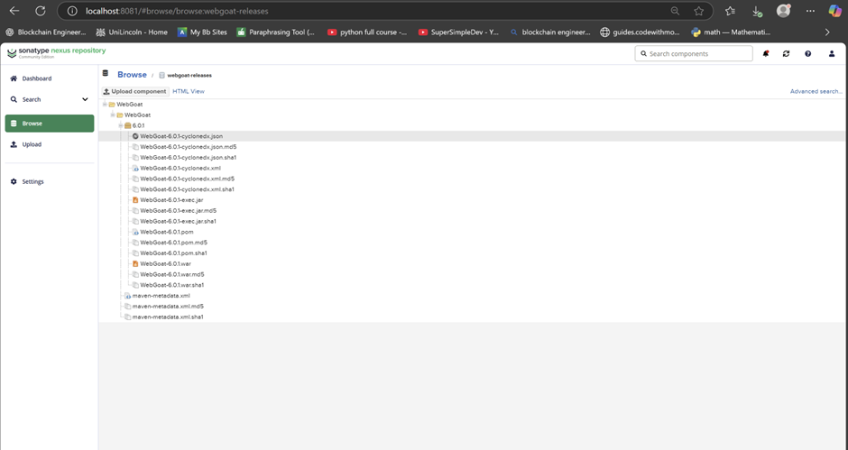

```markdown
# Phase 4: Maven Consumer Project – Artifact Retrieval from Nexus

## Objective  
The objective of this phase was to validate the successful retrieval of WebGoat artifacts deployed to Nexus during Phase 3 by simulating their consumption within a separate Maven-based project. This test confirms that internal development teams, build agents, or automated CI/CD pipelines can reuse versioned application components published to a secure internal repository. This is a critical capability in enterprise DevOps environments for supporting traceable, governed, and scalable software delivery practices.

## Step-by-Step Execution

### 1. Creation of a New Maven Consumer Project  
To ensure a clean and independent test environment:  
- Created standalone Maven project outside WebGoat-Legacy source tree  
- Scaffolded using `mvn archetype:generate`  
- Resulting structure:  
  - Basic Java application  
  - Independent `pom.xml`  
  - Separate source directories  

### 2. Configuration of pom.xml to Reference Nexus Repository  
```xml
<repositories>
    <repository>
        <id>nexus</id>
        <url>http://localhost:8081/repository/webgoat-releases/</url>
    </repository>
</repositories>

<dependencies>
    <dependency>
        <groupId>org.owasp.webgoat</groupId>
        <artifactId>WebGoat</artifactId>
        <version>6.0.1</version>
        <type>war</type>
    </dependency>
    <dependency>
        <groupId>junit</groupId>
        <artifactId>junit</artifactId>
        <version>4.13.2</version>
        <scope>test</scope>
    </dependency>
</dependencies>
```

### 3. Triggering a Fresh Dependency Resolution and Build  
```bash
mvn clean install -U
```
- Forces fresh download from Nexus  
- Recompiles from scratch  
- Validates dependency resolution  

### 4. Verification of Successful Artifact Retrieval  
- Build logs confirm successful WAR retrieval  
- All dependencies resolved  
- Local cache populated at `~/.m2/repository`  
- Unit tests executed successfully  

## Outcome  
Confirmed capabilities:  
- ✔ Controlled internal consumption of trusted artifacts  
- ✔ Reusability of versioned components  
- ✔ Transparent artifact origin tracking  

Enterprise impact:  
- Enables secure CI/CD pipelines  
- Supports governance requirements  
- Scales artifact sharing across teams  
```
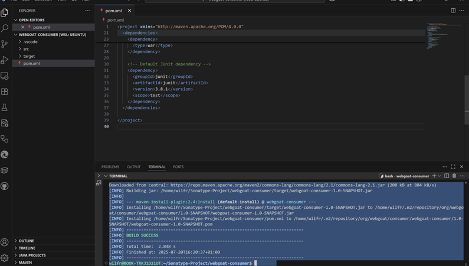

```markdown
# Phase 5: Dockerisation and Image Publishing

## Objective  
The goal of this phase was to containerise the WebGoat application and securely publish it to an internally hosted Docker registry using Nexus Repository Manager. This ensures the application is packaged in a portable, reproducible, and version-controlled format that can be consumed by internal teams or automated pipelines as part of a secure software delivery lifecycle.

## Execution Summary

### 1. Dockerfile Creation  
Production-ready Dockerfile configuration:  
```dockerfile
FROM openjdk:8-jre-alpine
WORKDIR /app
COPY WebGoat-6.0.1-war-exec.jar .
EXPOSE 8080
CMD ["java", "-jar", "WebGoat-6.0.1-war-exec.jar"]
```

Key features:  
- Lightweight Java 8 Alpine base  
- Explicit port exposure (8080)  
- Single JAR execution  

### 2. Image Build  
```bash
docker build -t webgoat:6.0.1 .
```
Validation:  
- Confirmed container runtime stability  
- Verified Tomcat accessibility  

### 3. Nexus Docker Repository Setup  
Configured in Nexus UI:  
- Name: `docker-webgoat`  
- Type: Hosted Docker  
- Port: 8082  
- HTTP (local testing)  
- Authentication required  

### 4. Authentication Configuration  
```bash
docker login localhost:8082
```
Security steps:  
1. Enabled "Docker Bearer Token Realm"  
2. Used Nexus admin credentials  
3. Verified CLI connectivity  

### 5. Image Tagging and Push  
```bash
docker tag webgoat:6.0.1 localhost:8082/webgoat/webgoat:6.0.1
docker push localhost:8082/webgoat/webgoat:6.0.1
```
Push confirmation:  
- All layers uploaded  
- Manifest/digest recorded  

### 6. Verification  
Nexus UI checks:  
- Image visible at `/webgoat/webgoat:6.0.1`  
- Metadata intact  
- Accessible via pull  

## Outcome  
Achieved:  
- ✔ Production-grade containerisation  
- ✔ Versioned image in private registry  
- ✔ Secure authentication workflow  
- ✔ Ready for CI/CD consumption  

Enterprise benefits:  
- Full supply chain traceability  
- Controlled image distribution  
- Cloud-ready deployment  
```


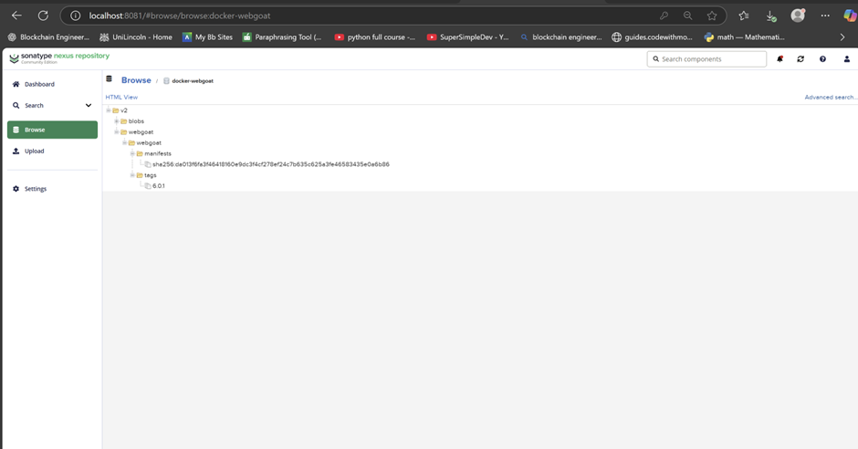

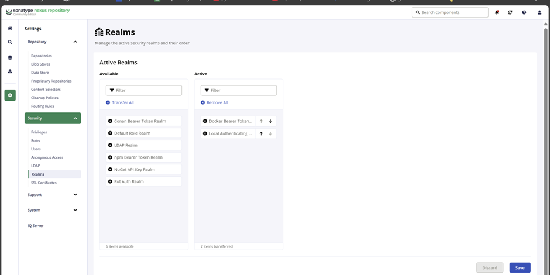

```markdown
# Phase 5B: Docker Consumer Pull Validation

## Objective  
The goal of this validation step was to confirm that the Docker image of the WebGoat application, previously published to the internal Nexus Docker registry (docker-webgoat), can be successfully pulled and executed by downstream systems or team members. This simulates real-world consumption by developers, testers, or CI/CD agents, and ensures that the internal image repository is functioning correctly for secure software delivery.

## Step 1: Pulling the Image from Nexus  
With authentication already configured and confirmed during the image publishing phase, I initiated a Docker image pull using the fully qualified image path and tag from the internal registry. The image was retrieved successfully, and the Docker client verified its integrity by displaying the digest and confirming that the latest version of the image was downloaded.  
This proved that the Nexus Docker registry is fully accessible and capable of serving tagged container images on demand.

## Step 2: Running the Pulled Image Locally  
To test the runtime behaviour of the image, I launched a container using the pulled image and mapped the internal port to my local machine. Once the container started, I opened a browser and navigated to the expected application URL.  
The WebGoat interface loaded successfully, and all core application features were accessible. This confirmed that the image functions as expected when pulled from the registry, and that no configuration or dependency issues were introduced during the publishing process.

## Outcome  
This pull validation exercise confirmed that:  
• The Nexus Docker registry is hosting the WebGoat image securely and correctly.  
• The image is properly tagged and versioned (6.0.1), making it suitable for controlled distribution.  
• The image can be consumed seamlessly by internal developers, automated build agents, or test environments.


# Phase 6: Nexus IQ Server Security Scan

## Objective
The aim of this phase was to perform a complete security and license policy evaluation of the WebGoat application using Sonatype IQ Server and the IQ CLI tool. The plan was to scan a .war artifact built locally during the build stage and map it to a manually registered application ID in the IQ Server. This required preparing the environment, installing and configuring the IQ Server, resolving CLI-related issues, and reviewing the final security report.

## Initial Setup and Java Compatibility
My system was initially running Java 8 (OpenJDK 1.8), but when I tried to start the IQ Server, it failed with a UnsupportedClassVersionError. The error message clearly indicated that the server had been compiled with a newer Java version (class file version 61.0), which corresponds to Java 17. Since Java 8 only supports up to version 52.0, the IQ Server couldn't run.

To fix this, I installed Java 17 and configured my system to support both Java 8 and 17 side by side. I updated my .bashrc file with environment variables and aliases to switch easily between versions. After sourcing the file and activating Java 17, I verified it was working correctly by checking the version — this confirmed the server would now be compatible with the runtime environment.

## IQ Server Installation and Configuration
I downloaded and extracted the nexus-iq-server-1.193.0-01 bundle. To launch the server, I had to include additional JVM flags to open up certain internal Java modules required for the IQ Server to run on Java 17. Once started, the server became available at localhost:8070.

I logged in using the default admin credentials and uploaded the license file. Within the UI, I created a new application entry under the Sandbox organization. I named it WebGoat, assigned it an Application ID of webgoat-app, and chose "Internal" as the category. This ID was important because the CLI scan references it to associate results with this application.

## CLI Tool Issue and Workaround
The CLI scanner (iq-cli.jar) wasn't included in the IQ Server bundle, which I originally expected it to be. I tried downloading the latest CLI from the public Sonatype URL, but the link returned a 404 error.

To work around this, I found and downloaded version 1.160.0-01 of the CLI directly from Sonatype's archive. This version was fully compatible with the server version I had installed and contained all the features I needed to proceed with the scan.

## Building the WebGoat Artifact
Before running the scan, I needed a .war file for the WebGoat application. I used Maven to build the project, skipping tests to speed up the process. This produced the required artifact: WebGoat-6.0.1.war, located in the target directory.

## Running the IQ CLI Scan
With the server up and the CLI tool ready, I ran the scan against the .war file. I passed the admin credentials, the server URL, the application ID (webgoat-app), and set the stage to build.

The CLI tool successfully connected to the IQ Server and authenticated. It also auto-discovered Git metadata like the current commit and repository URL using jGit. In total, 67 components were scanned.

The scan results were as follows:
- 53 critical policy violations
- 70 severe policy violations
- 8 moderate policy violations

These issues affected 21 components critically, 11 severely, and 2 moderately. The CLI output included a link to the full report hosted on the IQ Server UI.

## Reviewing the Report
I accessed the report via the IQ Server dashboard. From there, I captured key screenshots including:
- A summary of violations broken down by severity
- A list of all affected components
- Any license issues found
- A breakdown of the specific policy rules that were triggered

I reviewed the results and compared them against our policy thresholds to assess the overall risk level of the WebGoat application.

## Conclusion
This phase successfully completed the security scanning integration using Sonatype IQ Server. I resolved the Java compatibility issue, sourced and configured the correct CLI tool, built the application, and ran a full policy evaluation against it. The results are now available in a detailed report and are ready to be added to the project's documentation and presentation materials.


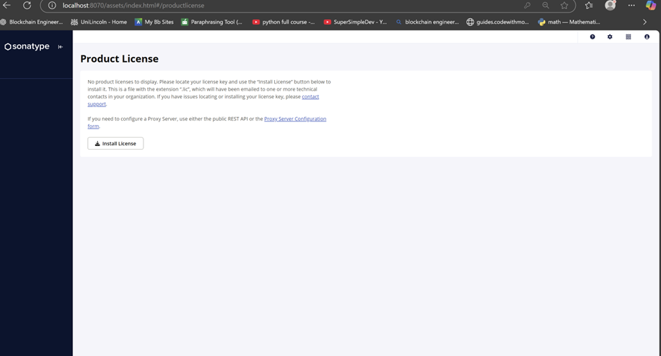

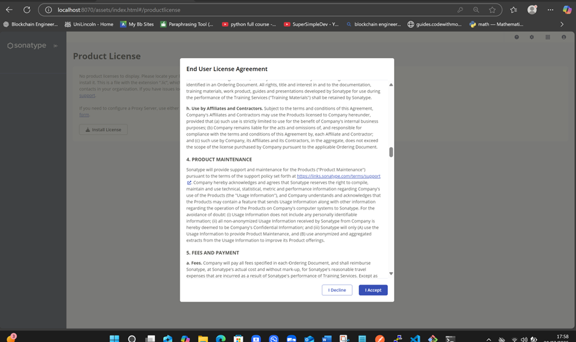

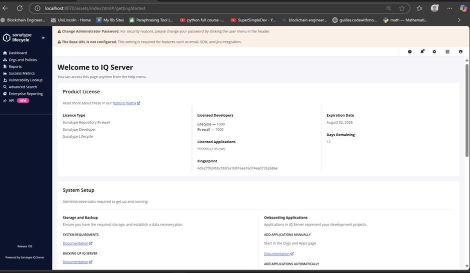

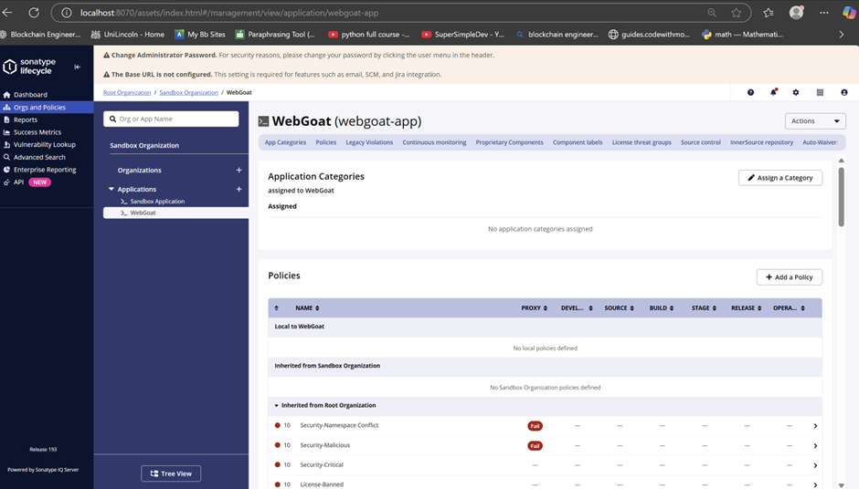

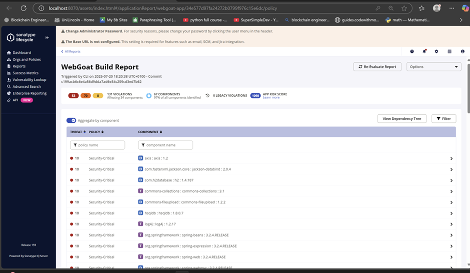

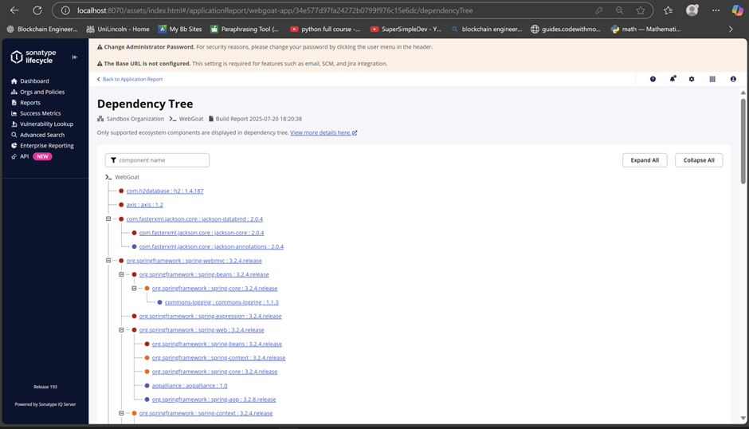


# Phase 6B: Detailed Analysis and Application of IQ Server Capabilities for Remediation

After completing the initial scan of the WebGoat application using Sonatype IQ Server and the CLI, the results revealed a total of 131 active policy violations across 34 out of 67 open-source components. These included 53 critical, 70 severe, and 8 moderate issues. The scan not only highlighted technical risks but also surfaced licensing and compliance concerns that would need to be addressed before any production deployment.

This part of the phase focused on understanding how IQ Server supports remediation — not just identifying problems but giving teams the tools to operationalise fixes and enforce governance across the software lifecycle. Below is a breakdown of the features I explored and applied.

## Real-Time Component Intelligence and SBOM Accuracy

IQ Server generated a full software bill of materials (SBOM) for the WebGoat build. It accurately identified all components, including deeply nested transitive dependencies, and clearly distinguished between direct and indirect usage.

For example, it picked out specific versions like `jackson-databind:2.0.4` and `commons-collections:3.1`, providing over 95% SBOM completeness. This level of detail gave me clarity on where vulnerabilities were coming from and helped me avoid wasting time on irrelevant upgrades.

Unlike some scanners that rely purely on public CVE databases, IQ Server pulls from Sonatype's proprietary research (OSS Index), which I found to be far more reliable and up to date.

## Contextual Policy Evaluation

Rather than just listing CVEs, IQ Server evaluated each component against a default policy set. The policy engine was context-aware — factoring in severity scores, license types, component age, and end-of-life status.

In the WebGoat scan, any component with a known critical vulnerability or non-compliant license was automatically flagged and mapped to a policy action. This allowed me to understand not just what was vulnerable, but why it failed policy and what that meant for enforcement.

It was clear that this system could scale across environments by applying different policies per stage (development, build, release), which gives teams much more control compared to basic scanners.

## Upgrade Guidance and Fix Recommendations

One of the most useful features was the remediation advice. Instead of just pointing out vulnerable packages, IQ Server provided specific version recommendations.

For example, the report flagged `log4j:1.2.17` with multiple critical issues and recommended upgrading to `log4j-core:2.17.2`, a maintained and secure alternative.

This removed guesswork and made it easier to plan safe upgrades that wouldn't break the application or introduce new licensing concerns.

## Policy Staging and Lifecycle Awareness

The scan I performed was mapped to the build stage. This was important because IQ Server uses stage-aware policies, so the same component may be allowed in development but blocked during build or release.

This flexibility made a lot of sense — during development you might allow medium-risk components, but by the time you're releasing, policies should enforce stricter compliance. It showed that the platform can integrate cleanly into DevSecOps pipelines without slowing developers down unnecessarily early on.

## Waivers and Justified Exceptions

IQ Server also supports waivers, which means if a risky component can't be removed immediately — for example, due to legacy integration or lack of alternatives — a structured waiver can be applied.

Waivers in IQ Server require justification and can be time-limited, ensuring visibility and traceability. This means risks are acknowledged, not hidden. In a real-world scenario (e.g. with `axis:1.2` for old SOAP integrations), I would be able to apply a waiver while working on a longer-term solution.

## Continuous Monitoring and Alerts

Although my scan produced a static report on July 20, 2025, IQ Server supports continuous re-evaluation of previously scanned components.

This means that if a new vulnerability is disclosed tomorrow, IQ Server can alert teams and update the policy evaluation automatically — no need to manually re-scan. This capability is critical for long-term risk management in production.

## Pipeline Integration and Enforcement

IQ CLI is designed to be embedded into CI/CD tools like Jenkins, GitHub Actions, or GitLab. This allows you to block builds if a critical vulnerability is introduced, enforce policy on every pull request, and generate audit trails for compliance teams.

For future use, I plan to embed these checks into automated pipelines, particularly for production workloads, to ensure that violations are caught early and remediated before they reach customers.

## Summary of Key Outcomes

• I successfully scanned WebGoat and confirmed 131 actionable policy violations.  
• Java compatibility was resolved early to ensure the latest server could run securely.  
• I sourced and used a known working CLI version when the expected one wasn't available.  
• I reviewed each violation in context — not just as a CVE, but in relation to license risk, usage type, and business impact.  
• I identified realistic upgrade paths for key components and documented waivable risks for legacy dependencies.  
• I evaluated how IQ Server enables policy enforcement across the software lifecycle — from development to release.  
• I confirmed that this setup can scale and integrate into CI/CD, supporting continuous governance and ongoing monitoring.  

## Conclusion

Sonatype IQ Server is far more than a static vulnerability scanner. It provides full-spectrum governance, precise identification, curated remediation guidance, and structured policy enforcement.

In this project, it helped me transition from vulnerability awareness to vulnerability management. I moved from simply identifying open-source risks in WebGoat to planning practical next steps — fixing what could be upgraded, flagging what needed waivers, and understanding how to enforce policies in future builds.

Where most tools stop at detection, IQ Server supports a complete DevSecOps flow — from policy definition, to remediation, to ongoing risk evaluation. That's what made it particularly valuable in this phase of the project.